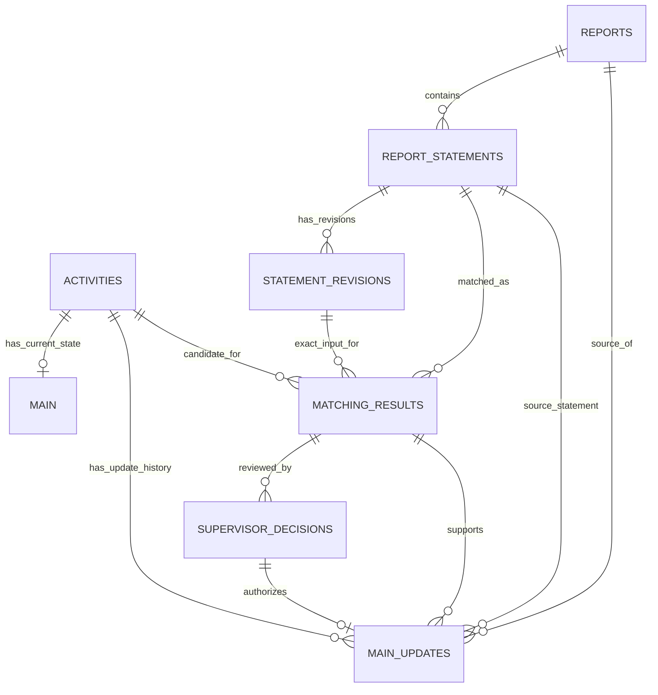

# PS 26122: Field Progress Intelligence (MVP)

**Smart India Hackathon 2026 | Problem Statement 26122**

Turns fragmented, discipline-wise field progress reports into structured, schedule-linked execution data. A contractor types or uploads a plain-language site update, and the system extracts the facts, matches them to the correct planned activity (L6) in the project schedule, and updates the plan only when it is confident. Uncertain cases go to a human supervisor.


---

## Table of Contents

1. [Problem Statement](#1-problem-statement)
2. [What the MVP Does](#2-what-the-mvp-does)
3. [System Architecture](#3-system-architecture)
4. [Tech Stack](#4-tech-stack)
5. [Project Structure](#5-project-structure)
6. [Getting Started](#6-getting-started)
7. [Using the App](#7-using-the-app)
8. [Database Architecture](#8-database-architecture)
9. [Configuration](#9-configuration)
10. [Evaluation Tools](#10-evaluation-tools)
11. [Roadmap / Future Scope](#11-roadmap--future-scope)

---

## 1. Problem Statement

### Background

Infrastructure project schedules cascade from macro milestones (L1) down to micro, executable activities (L5/L6), spanning multiple engineering disciplines (civil, piping, static/rotating equipment, electrical, instrumentation, HSE), each executing and reporting in parallel. The baseline plan is well structured (Primavera / MS Project), but actual execution data flows back through daily progress reports, site diaries, discipline-wise spreadsheets and verbal supervisor updates. Each has its own format and cadence, and they are largely disconnected from the L5/L6 activity IDs in the plan.

### Problem

There is no reliable, low-friction way to capture the actual start and end of L5/L6 activities across disciplines and auto-link them to the plan. Input quality varies with manpower skill, reporting discipline and format. Field execution is often more granular than the planned WBS, and disciplines describe the same physical progress differently (for example, "spool erected" versus the plan's "Erect Line 24-XX"). As a result:

- Actual progress data is fragmented, delayed and inconsistently structured.
- Manual reconciliation with the baseline is slow, error-prone, and lags the schedule update cycle by days or weeks.
- Downstream analytics, delay/risk analysis and forecasting inherit poor-quality, late data.
- When a project closes, real durations, bottlenecks and deviations from plan are rarely captured in a structured, queryable form, so they are lost instead of feeding future planning.

### Expected outcome

- Ingest heterogeneous discipline-wise inputs (free-text daily reports, spreadsheets, scanned diaries, Primavera / MS Project exports) and extract activity-level actual start and end events.
- Offer an LLM-based conversational or voice interface (a "time agent") for site supervisors to log activity start and end with minimal friction, while still producing structured output.
- Fuzzy-match extracted descriptions to the correct L5/L6 plan node, handling terminology and granularity differences, and flag unmatched or new activities for planner review instead of silently dropping them.
- Auto-update actual start and end dates in the schedule / PMIS in near real time, with a confidence score and audit trail per entry.
- Produce a clean, discipline-tagged actual-progress dataset that feeds (a) performance analytics, delay/risk pattern discovery and forecasting, and (b) institutional memory: a growing, queryable repository of real execution patterns (actual durations, recurring delay causes, discipline-wise productivity).

A working prototype ingesting two to three varied input formats, with extraction and schedule linking, is the target. Full production-grade OCR / ASR is not required. Live project data is not shared, so this repository uses **synthetic** data of similar structure.

### Example

```text
"24-inch CS spool erection on Line 24 completed on 30 Aug by ABC Piping."
        ↓
discipline: Piping | asset: Line 24 | status: COMPLETED | finish: 2026-08-30
contractor: ABC Piping | matched activity: L6-xxx | confidence: 0.91 | AUTO_ACCEPTED
```

---

## 2. What the MVP Does

- **Structured extraction:** an LLM converts a free-text statement into a validated `ExtractedProgress` object (activity, asset, discipline, location, status, dates, progress %, contractor, delay reason, explicit activity IDs, and a supporting evidence quote).
- **Deterministic normalization and validation:** dates, times and delay-reason categories are handled in Python and Pydantic, not by the LLM. A time of day is never invented.
- **Two-stage L5/L6 matching:** hybrid retrieval builds a shortlist, then an LLM reranks only that shortlist.
- **Confidence calibration:** every match ends as `AUTO_ACCEPTED`, `REVIEW`, `UNMATCHED` or `ERROR`, with a full candidate audit trail.
- **Safe writes:** the plan only changes for auto-accepted matches or supervisor-approved reviews. Anything that would lower progress or rewrite a finish date is sent to review instead.
- **Role-based web app:** contractors submit reports, and supervisors approve accounts, review uncertain matches and triage possible new activities.
- **Institutional memory:** searchable history, discipline productivity and delay-cause breakdowns built from applied updates.
- **Multiple input formats:** `.txt`, `.log`, `.csv`, `.xlsx` / `.xlsm` and `.pdf` (PDF needs an extra package, see [Getting Started](#6-getting-started)).
- **Provider-neutral LLM layer:** switch between Gemini and Groq with one environment variable.

---

## 3. System Architecture

### 3.1 End-to-end pipeline

```text
Contractor statement
        ↓
LLM extraction                 → ExtractedProgress
        ↓
Python normalization           (dates, times, delay-reason categories)
        ↓
Pydantic + business validation → ProgressEvent
        ↓
Hybrid retrieval               (TF-IDF + spaCy vectors + fuzzy + rules + IDs + raw text)
        ↓                        → dynamic shortlist of 8 to 15 activities
LLM rerank                     (scoped to the shortlist only)
        ↓
Confidence calibration         → AUTO_ACCEPTED / REVIEW / UNMATCHED
        ↓
MatchResult + candidate audit trail → safe write to the database
```

**Design principle:** the extraction model is deliberately not allowed to decide the L5/L6 match. The extraction schema, the `ProgressEvent` contract and the matcher are decoupled, so any stage can be upgraded without touching the others.

### 3.2 Matching engine (`src/semantic_match.py`)

**Stage 1: hybrid retrieval.** Scores every schedule activity by combining:

| Signal | Purpose |
|---|---|
| TF-IDF over character n-grams | Robust to partial and substring overlap |
| spaCy `en_core_web_md` vector cosine | Distributional semantics (e.g. "erect" ≈ "erection" ≈ "install") |
| RapidFuzz token-set matching | Robust to word reordering and typos |
| Asset / discipline / location rules | Deterministic bonuses (never date-based) |
| Exact activity code, activity ID or WBS | Direct hit when the report quotes an identifier |
| Cleaned report sentence | Light second signal when extracted fields are thin |

**Stage 2: LLM rerank.** The LLM sees only the shortlist (not the full schedule) and returns one pick with a confidence score.

**Stage 3: Python decides.** Final confidence starts from the LLM's score, and Python can only lower it. All thresholds live in one config block at the top of `src/semantic_match.py`, and the module refuses to start if the block is inconsistent.

| Condition | Result |
|---|---|
| Final confidence ≥ `CONF_AUTO_ACCEPT` (0.85) | `AUTO_ACCEPTED` |
| Final confidence ≥ `CONF_REVIEW` (0.55) | `REVIEW` |
| Below that, or the LLM found nothing | `UNMATCHED` (flagged as a possible new or unlisted activity, not dropped) |
| A rival ranks above the pick, scores within `AUTO_ACCEPT_MIN_MARGIN` (0.15) of it, shares the asset, or sits in the same WBS group | Ambiguous: confidence capped at `AMBIGUITY_CAP` (0.80, or 0.75 for near-duplicates), so the result is `REVIEW` |
| An exact asset match, or an activity ID quoted in the report, separates the pick from that rival | The rival no longer counts as ambiguity |
| The matcher itself crashes | `ERROR`: shown with a Retry button, never stored as a possible new activity |

### 3.3 Safe writes

Whatever calls `save_progress_update()`, the plan changes only when:

- the match is `AUTO_ACCEPTED`, or
- a supervisor approves a `REVIEW` match (`decide_review_update()`, at most once).

Other rules:

- `REVIEW` and `UNMATCHED` results are stored as history only. A `REVIEW` row keeps its candidate in `pending_l6_id` and receives `l6_id` only once it is really applied.
- An automatic update that would lower progress, change an existing finish date, or move a `COMPLETED` activity backwards is not applied. It is stored as `REVIEW` with the reason.
- The same statement (report date + reporter + text) is stored only once.
- Institutional-memory statistics count only applied updates.

### 3.4 Reliability

- **LLM calls:** one provider object per process, a hard time limit per call, and limited retries with backoff for rate-limit and transient errors. Timeouts, schema errors and bad requests are not retried. Persistent failures surface as `ProviderTimeoutError` / `ProviderUnavailableError` so an outage can be told apart from bad output.
- **Background extraction:** extraction runs in the background and saves each statement as it finishes, so long files show live progress. A failed statement stays visible with its reason and a **Retry failed** button, and does not stop the others.
- **Degraded extraction:** if extraction fails, the row is flagged (`extraction_degraded`) and holds keyword-based guesses instead of LLM output.

---

## 4. Tech Stack

| Layer | Technology |
|---|---|
| Language | Python 3.10+ |
| Web app | Flask 3, Jinja2 templates, vanilla JS and CSS |
| Data validation | Pydantic v2 |
| Database | SQLite (local, generated on bootstrap) |
| LLM providers | Google Gemini (`google-genai`), Groq (via `openai` client) |
| Retrieval | scikit-learn (TF-IDF), spaCy `en_core_web_md`, RapidFuzz |
| File ingestion | openpyxl (Excel), csv, optional PyMuPDF (PDF) |
| Config | python-dotenv |

---

## 5. Project Structure

```text
SIH_PS26122_Binary.Blades/
├── data/
│   ├── schedule.json           # 81 planned L6 activities (source of truth for the plan)
│   ├── examples.txt            # sample contractor statements
│   ├── labelled_cases.json     # labelled cases for threshold calibration
│   └── retrieval_cases.json    # retrieval-only test cases
├── prompts/                    # LLM prompt templates (extraction, matching)
├── src/
│   ├── extract.py              # statement → ExtractedProgress → ProgressEvent
│   ├── normalize.py            # deterministic normalization and validation
│   ├── semantic_match.py       # hybrid retrieval + rerank + confidence rules
│   ├── providers.py            # Gemini / Groq providers, timeouts, retries
│   ├── database.py             # schema, migrations, safe-write logic
│   ├── auth.py                 # roles, password hashing, account approval
│   ├── pipeline_runs.py        # server-side storage for in-progress report runs
│   ├── institutional_memory.py # read-only queries over execution history
│   ├── seed_history.py         # synthetic history for the demo
│   ├── calibrate.py            # threshold calibration report
│   ├── retrieval_eval.py       # retrieval quality report
│   ├── bootstrap.py            # one-command setup
│   ├── schemas.py              # Pydantic models
│   └── timeutil.py             # timezone-aware time helpers
├── ui/
│   ├── app.py                  # Flask application
│   ├── templates/              # ingest, extracted, matched, review, planner, memory, ...
│   └── static/                 # CSS, JS, images
├── .env.example
├── requirements.txt            # core + matching engine
└── requirements_ui.txt         # web app
```

---

## 6. Getting Started

### Prerequisites

- Python 3.10 or newer
- A Gemini or Groq API key

### Installation

```bash
git clone https://github.com/Faizankhan113/SIH_PS26122_Binary.Blades.git
cd SIH_PS26122_Binary.Blades

python -m venv .venv
# Windows: .venv\Scripts\activate      macOS/Linux: source .venv/bin/activate

pip install -r requirements.txt -r requirements_ui.txt
```

**Install the spaCy model.** `en_core_web_md` is not on PyPI, so install it from its release wheel.

```bash
# Python 3.13 (matches spacy 3.8)
pip install "https://github.com/explosion/spacy-models/releases/download/en_core_web_md-3.8.0/en_core_web_md-3.8.0-py3-none-any.whl"

# Python 3.10 to 3.12 (3.7.1 also works)
pip install "https://github.com/explosion/spacy-models/releases/download/en_core_web_md-3.7.1/en_core_web_md-3.7.1-py3-none-any.whl"
```

**Optional, for PDF uploads:**

```bash
pip install pymupdf
```

### Configure

```bash
cp .env.example .env        # Windows: copy .env.example .env
```

Edit `.env`:

```env
LLM_PROVIDER=gemini          # gemini | groq
GEMINI_API_KEY=your_key_here
FLASK_SECRET_KEY=<run: python -c "import secrets; print(secrets.token_hex(32))">
```

### Run

```bash
python -m src.bootstrap      # creates DB, loads schedule, creates demo users, seeds history
python -m ui.app             # open http://127.0.0.1:5000
```

Bootstrap is safe to re-run. Useful flags: `--fresh` (delete and rebuild the database) and `--no-history` (skip synthetic history).

### Sample accounts

| Role | Username | Password |
|---|---|---|
| Contractor | `contractor1` | `contractor123` |
| Supervisor | `supervisor1` | `supervisor123` |

These are sample credentials for local use only.

---

## 7. Using the App

**Contractor flow (3 steps)**

1. **Ingest:** paste statements or upload a `.txt` / `.csv` / `.xlsx` / `.pdf` file, and set the report date.
2. **Extract:** statements are extracted in the background. Review the structured fields and retry any failures.
3. **Match:** each statement is matched to a schedule activity, with its confidence, status and alternative candidates. Accepted updates are written to the plan.

**Supervisor flow**

- **Review queue:** approve or reject contractor sign-ups, and approve or reject `REVIEW` matches with full context (candidate, alternatives, reason).
- **Planner list:** statements that matched nothing may be new or unlisted work. A supervisor can **Dismiss** an item or **Mark as new activity**. Both are notes only, and the schedule is never edited automatically.

**Institutional Memory (all logged-in users)**

Search applied history and view summary stats, per-discipline outcome mix, schedule variance and productivity ratio, and recurring delay causes.

### How a report run is stored

The login cookie holds only the user and a `run_id`. Statements, extraction results and match rows live in `pipeline_runs` and `pipeline_run_items`, visible only to the user who created them. Runs are scratch data: starting a new report or pressing Reset discards the old one, and runs untouched for 24 hours are removed at startup and on each new ingestion.

---

## 8. Database Architecture

This section has two parts: the schema the MVP **runs on today** (8.1), and the **target design** for the final version (8.2).

### 8.1 MVP schema (implemented)

The MVP uses **SQLite** (`data/ps26122.db`, generated locally and git-ignored). Schema creation and in-place migrations run automatically at startup via `initialize_database()`, and existing databases upgrade without losing rows.

| Table | Role |
|---|---|
| `planned_l6_activities` | The plan. Planned fields come from `data/schedule.json`. Execution state (actual dates, progress, status) is written only by applied updates. |
| `progress_updates` | Append-only audit log of every processed statement: raw text, extracted fields, match confidence, method and reason, alternative candidates, reporter, approver, and planner decisions on unmatched items. |
| `users` | Two roles, `contractor` and `supervisor`. Passwords are hashed. Contractor sign-ups stay `pending` until a supervisor approves them. |
| `pipeline_runs` / `pipeline_run_items` | Scratch data for one in-progress report and its per-statement extraction state. Cleaned up automatically. |

Key decisions:

- **Plan and history are separate.** Past rows in `progress_updates` are never rewritten, so every decision stays auditable.
- **A pending match never touches the plan.** A `REVIEW` row keeps its candidate in `pending_l6_id`, and `l6_id` is set only when the update is really applied.
- **Idempotent ingestion.** A unique index on `fingerprint` (report date + reporter + normalised text, excluding `REJECTED` rows) stores each statement once, and a rejected statement can still be corrected and resubmitted.
- **Archive, never delete.** An activity removed from `schedule.json` gets `archived_at` set, because history refers to it.
- **Honest timestamps.** A time of day is stored only when the report stated one (`*_time_stated` flags). All timestamps are timezone-aware ISO strings (default `Asia/Kolkata`).

### 8.2 Target design (final version)

The final version separates source material, AI output, human decisions and live state into eight tables. This is a **working design (v0.1)**, and it is not implemented in the MVP code yet. It is a logical design, so it carries over to the PostgreSQL migration on the roadmap.

| Table | Role |
|---|---|
| `activities` | Authoritative, admin-maintained L6 activity master, including planned dates. |
| `reports` | One row per submitted report: source type, file location, **report datetime**, submitter, processing status. |
| `report_statements` | One row per AI-extracted statement, with extraction provider, model, prompt version and status. |
| `statement_revisions` | Contractor-corrected versions of a statement. Matching always references the exact revision it used. |
| `matching_results` | One row per matching attempt: the AI's **top three candidates with scores**, original AI classification, confidence and reasoning, plus a summary of the supervisor's final verdict for accuracy evaluation. |
| `supervisor_decisions` | Append-only audit of every supervisor decision and edit. This is the only source that can authorize a live-data change. |
| `Main` | **Live state**, one row per activity: actual start and finish, cumulative progress (0 to 100), status, and pointers to the report, statement and decision that last set it. |
| `main_updates` | Append-only audit of each approved update: previous, reported and new values, and whether it was `APPLIED`, `HISTORICAL_ONLY` or `NO_CHANGE`. |



The existing users table is reused (reports, revisions and decisions reference it), so no second user table is created.

**Data flow**

1. A report is submitted (`reports`) and the AI extracts its statements (`report_statements`).
2. The contractor corrects a statement, which is saved as a revision (`statement_revisions`).
3. The matcher runs on that exact revision and stores its top three candidates and classification (`matching_results`).
4. The supervisor reviews and the decision is recorded (`supervisor_decisions`).
5. If the report is the newest for that activity, `main_updates` is inserted and `Main` is changed **in one transaction**. Otherwise it is kept as `HISTORICAL_ONLY`.

**Key rules**

- **Only supervisor-approved results can change `Main`.** Rejected and unresolved decisions never do.
- **Newest report wins, not newest approval.** `Main` follows the latest `report_datetime`, and the later approval time breaks ties. An older report approved out of order is kept in `main_updates` but does not overwrite `Main`.
- **Progress is cumulative (0 to 100).** It may decrease only with explicit supervisor approval, and an approved report with an unchanged percentage is still recorded.
- **AI output is never overwritten.** The original classification, candidates and scores stay separate from the supervisor's verdict, which makes AI accuracy measurable.
- **Errors are not "not found".** A matcher execution error is kept distinct from a valid `NOT_FOUND` result.
- **Idempotent and auditable.** `main_updates.decision_id` is unique so a decision cannot be applied twice, audit tables are append-only, and audited rows are never cascade-deleted.
- **Fixed vs live data.** Planned fields live only in `activities`, and only live values live in `Main` and `main_updates`.

**How the MVP maps to the target (approximate)**

| MVP | Target |
|---|---|
| `planned_l6_activities` (planned columns) | `activities` |
| `planned_l6_activities` (actual dates, progress, status) | `Main` |
| `progress_updates` | Split into `report_statements`, `matching_results`, `supervisor_decisions` and `main_updates` |
| `UNMATCHED` | `NOT_FOUND` |

Still open in the working design: whether to keep every contractor save as a revision, whether supervisor edits also create a revision, whether `main_updates` stores changed fields only or full snapshots, and when `Main` rows are created. Multi-project support (`projects`) and schedule versioning are deliberately left out for now.

---

## 9. Configuration

All settings are environment variables, documented in `.env.example`.

| Variable | Default | Purpose |
|---|---|---|
| `LLM_PROVIDER` | `gemini` | `gemini` or `groq` |
| `GEMINI_API_KEY` / `GEMINI_MODEL` | none / `gemini-3.5-flash` | Gemini settings |
| `GROQ_API_KEY` / `GROQ_MODEL` | none / `openai/gpt-oss-20b` | Groq settings |
| `FLASK_SECRET_KEY` | random per start | Signs the login cookie. Set it so sessions survive restarts. |
| `FLASK_DEBUG` | off | Set to `1` for auto-reload and the debugger |
| `PS26122_DB_PATH` | `data/ps26122.db` | Use a different SQLite file |
| `PS26122_TIMEZONE` | `Asia/Kolkata` | IANA timezone for stored timestamps |
| `PS26122_DEFAULT_PROJECT_ID` | `GPC-001` | Used only for schedule rows with no `project_id` |
| `PS26122_EXTRACT_WORKERS` | `4` | Statements extracted in parallel |
| `PS26122_RUN_TTL_HOURS` | `24` | Age after which report-run scratch data is deleted |
| `LLM_TIMEOUT_SECONDS` | `30` | Time limit per LLM call |
| `LLM_MAX_RETRIES` / `LLM_RETRY_BASE_SECONDS` | `2` / `1` | Retry policy for 429 and transient errors |

### Editing the schedule

`data/schedule.json` is the source of truth for planned activities. It is synced to the database once at app start (and by `python -m src.bootstrap`), so **restart after editing it**.

- Changed planned fields are updated, and execution state is kept.
- Removed activities are archived, not deleted.
- If `planned_duration` is missing, it is computed counting both the start and finish day (15 Jun to 24 Jun = 10 days).

### Schedule data

The bundled schedule has **81 realistic L6 activities** across seven execution areas and seven disciplines (Piping, Mechanical, Electrical, Instrumentation, Civil, HSE, QA/QC). Several activities intentionally share an area, discipline and related assets so that ambiguity handling is exercised. The seeded history is **synthetic**.

---

## 10. Evaluation Tools

Both scripts run against the same matching code as the app.

```bash
# How do the confidence thresholds behave? (auto-accept precision, review rate, etc.)
python -m src.calibrate                        # uses the configured provider
python -m src.calibrate --cases other.json --json

# Did retrieval put the right activity in the shortlist? (no LLM, no API key)
python -m src.retrieval_eval
python -m src.retrieval_eval --json
python -m src.retrieval_eval --show-all
```

Labelled cases live in `data/labelled_cases.json` (clear, ambiguous and unmatched cases) and `data/retrieval_cases.json` (explicit-ID, thin-field and noisy-sentence cases).

---

## 11. Roadmap / Future Scope

### 11.1 Coverage of the problem statement

| Expected outcome | Status in this MVP | Planned |
|---|---|---|
| Ingest free-text reports and discipline spreadsheets | **Built** (`.txt`, `.log`, `.csv`, `.xlsx`) | Discipline-specific templates |
| Ingest PDF reports | **Built** (text PDFs, optional PyMuPDF) | Scanned PDFs via OCR |
| Ingest scanned diaries | Not built | OCR ([11.2](#112-planned-features-and-tools)) |
| Ingest Primavera / MS Project exports | Not built (schedule is loaded from `schedule.json`) | Schedule import ([11.2](#112-planned-features-and-tools)) |
| Conversational / voice "time agent" | Not built | Voice agent ([11.2](#112-planned-features-and-tools)) |
| Fuzzy match to L5/L6, flag unmatched for planner | **Built** (hybrid retrieval, rerank, planner list) | Stronger retrieval and granularity handling |
| Confidence score and audit trail per entry | **Built** | Richer audit schema (section 8.2) |
| Auto-update actuals in the schedule / PMIS | **Built** for the app database | Write-back to Primavera / MS Project |
| Structured, discipline-tagged dataset | **Built** | Multi-project dataset on PostgreSQL |
| Analytics, delay/risk discovery, forecasting | Basic (Institutional Memory view) | Technical dashboard |
| Institutional memory | **Built** (search, productivity, delay causes) | Cross-project learning |

### 11.2 Planned features and tools

**Voice / conversational "time agent"**

Site supervisors speak an update in their own language, and an LLM agent turns it into the same structured event the text pipeline already produces. If a field is missing (which activity, start or finish, percent complete), the agent asks a short follow-up instead of presenting a form.

- Speech-to-text: **Indian-language ASR (AI4Bharat IndicWhisper / Sarvam)**
- Conversation and structuring: **LLM with tool-calling** through the existing provider layer (Gemini / Groq), emitting the current `ExtractedProgress` schema
- Output feeds the existing normalization, matching and supervisor-review pipeline unchanged

**Scanned site diaries (OCR)**

- **Tesseract / PaddleOCR** converts scanned diary pages and image-only PDFs to text, which then goes through the existing extraction pipeline
- Low-confidence OCR text is flagged for review instead of being trusted

**Primavera / MS Project integration**

- Import: read the baseline schedule from **Primavera P6 exports (XER / XML)** and **MS Project files**, replacing the hand-maintained `schedule.json` (planned libraries: `xerparser` / `PyP6Xer` for XER, `MPXJ` for MS Project)
- Write-back: push accepted actual start / finish dates to the PMIS through the **Primavera P6 EPPM API**, or as an export file where API access is not available
- Near real time: a background worker (**Celery + Redis**) applies approved updates as they arrive

**Matching strengthening**

- Replace the lexical retriever with **Sentence-Transformer embeddings and pgvector ANN search**. The retriever's `retrieve()` interface stays the same, so callers do not change.
- Replace the LLM rerank with a **Cross-Encoder**, keeping the Python business rules and confidence caps on top.
- Handle **granularity mismatch**: split a statement that covers several plan activities into single-activity statements at extraction time, and roll L6 progress up to L5.
- Grow the labelled set and re-calibrate thresholds with `src.calibrate`. Supervisor verdicts stored in `matching_results` become the ground truth for measuring AI accuracy.

**Extraction strengthening**

- Benchmark providers and models on the same labelled set before choosing the final model
- Domain glossary and few-shot examples per discipline in the prompts, with `prompt_version` tracked per statement
- Per-field confidence, and normalization of transcribed voice text in Indian languages to English before matching

**Technical dashboard**

A separate analytics app over the database:

- Planned vs actual progress and S-curves per discipline
- Delay causes and recurring bottlenecks
- Discipline-wise productivity and duration variance
- Matching quality: auto-accept rate, supervisor override rate, unmatched trend
- Delay/risk pattern discovery and forecasting (**scikit-learn / statsmodels**)
- Stack: **Streamlit + Plotly**, reading from PostgreSQL

**Data layer**

- Migrate from SQLite to **PostgreSQL with pgvector** for multi-user, multi-project deployment
- Adopt the **eight-table target schema** ([section 8.2](#82-target-design-final-version)): per-statement revisions, top-three candidate storage, and an append-only decision and update audit
- Multi-project support and a cross-project institutional memory: benchmark durations, delay causes and productivity from past projects, with semantic search over history via pgvector

### 11.3 Planned technology additions

| Area | Planned tools |
|---|---|
| Speech-to-text | AI4Bharat IndicWhisper / Sarvam |
| Conversational agent | LLM tool-calling (Gemini / Groq) |
| OCR | Tesseract / PaddleOCR |
| Schedule import | xerparser / PyP6Xer (Primavera), MPXJ (MS Project) |
| PMIS write-back | Primavera P6 EPPM API |
| Background jobs | Celery + Redis |
| Embeddings and rerank | Sentence-Transformers, Cross-Encoder |
| Database | PostgreSQL + pgvector |
| Dashboard and analytics | Streamlit, Plotly, scikit-learn / statsmodels |

---
